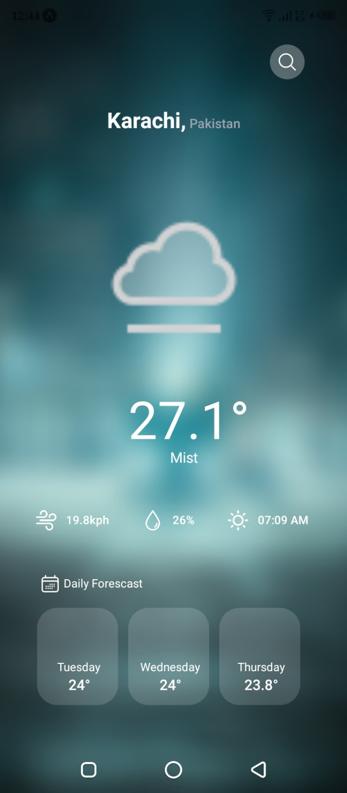
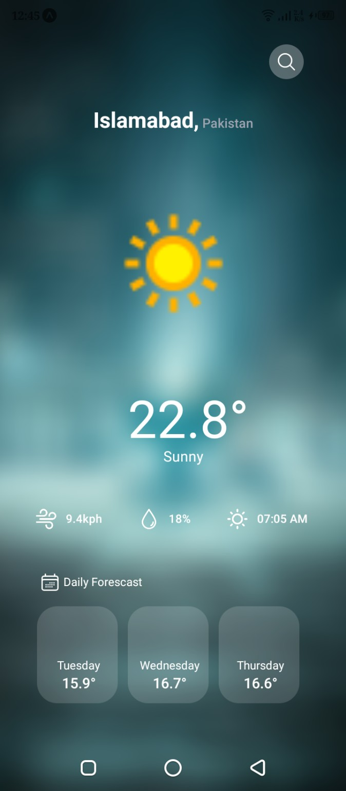
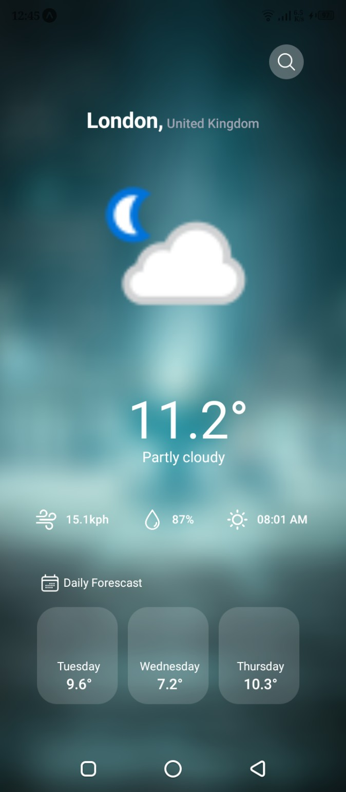

# 🌦️ React Native Weather App

A simple and user-friendly **Weather Application built with React Native**. The app allows users to search for any city and view **current weather conditions** along with a **7-day weather forecast** using a public weather API.

---

## 🚀 Features

* 🔍 **Search Weather by City**
* ☀️ **Current Weather Details**

  * Sunrise time
  * Humidity
  * Wind speed
  * Temperature & condition
* 📅 **7-Day Weather Forecast**
* 📊 **Progress Bar UI** for better data visualization
* 💾 **Local Storage** to save user data or last searched city
* 📱 Clean and responsive UI

---

## 🛠️ Tech Stack

* **React Native**
* **JavaScript**
* **VS Code**
* **WeatherAPI (Public API)**

---

## 🌐 API Used

Weather data is fetched from **WeatherAPI**:

* **API Provider:** WeatherAPI
* **API Type:** Current Weather & 7-Day Forecast
* **API Explorer:** [https://www.weatherapi.com/api-explorer.aspx#current](https://www.weatherapi.com/api-explorer.aspx#current)

> ⚠️ Note: You need to create a free account on WeatherAPI to get your own API key.

---

## 📦 NPM Libraries Used

* **Progress Bar Library** (for visual indicators)
* **Async Storage / Storage Library** (to store data locally)

---

## 📂 Project Setup

### 1️⃣ Clone the Repository

```bash
git clone https://github.com/your-username/your-repo-name.git
```

### 2️⃣ Install Dependencies

```bash
npm install
```

or

```bash
yarn install
```

### 3️⃣ Add API Key

Create a `.env` file or update the API key directly in your API service file:

```js
const API_KEY = "YOUR_WEATHER_API_KEY";
```

### 4️⃣ Run the App

For Android:

```bash
npx react-native run-android
```

For iOS:

```bash
npx react-native run-ios
```

---

## 📸 Screenshots

Below are some screenshots of the app showing weather results for different cities:

### Karachi, Pakistan



### Islamabad, Pakistan



### London, United Kingdom



---

## 📌 Future Improvements

* 📍 Auto-detect current location
* 🌙 Dark mode support
* ⭐ Favorite cities
* 🔔 Weather alerts & notifications

---

## 👨‍💻 Author

**Moiz Sheikh**
Software Engineer | React Native Developer

---

⭐ If you like this project, don’t forget to give it a star on GitHub!
